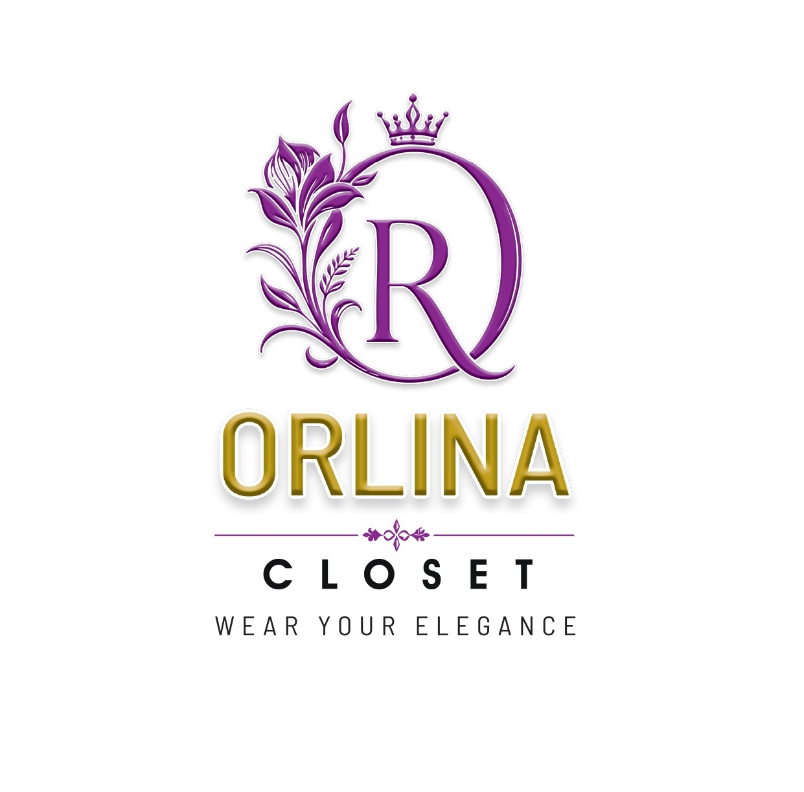

# ORLINA CLOSET

ORLINA CLOSET is a simple fashion and clothing brand based on Facebook Marketplace.
<div align="left">
    
</div>
<br>

##This project is a lightweight responsive QR landing page designed to help customers quickly connect with the brand through:
- Facebook Page
- Phone Contact
- QR Code Access
<br>
##The landing page includes:
- Brand logo
- Elegant minimal design
- Mobile responsive layout
- Direct contact options

## Features

- Responsive design
- Fashion brand styled UI
- Facebook redirect button
- One-tap phone call support
- QR code integration
- Simple and lightweight

## Technologies Used

- HTML5
- CSS3
- Font Awesome


## Live Preview

Scan the QR code to open the landing page.

<div class="qr-section">
    <h2>Scan QR Code</h2>
    
</div>

## Project Structure

```text
project/
│
├── index.html          # Main landing page
├── style.css           # Website styling
├── QR.py               # Python script to generate QR code
├── logo.png            # ORLINA CLOSET logo
├── qr.png              # Generated QR code image
└── README.md           # Project documentation
